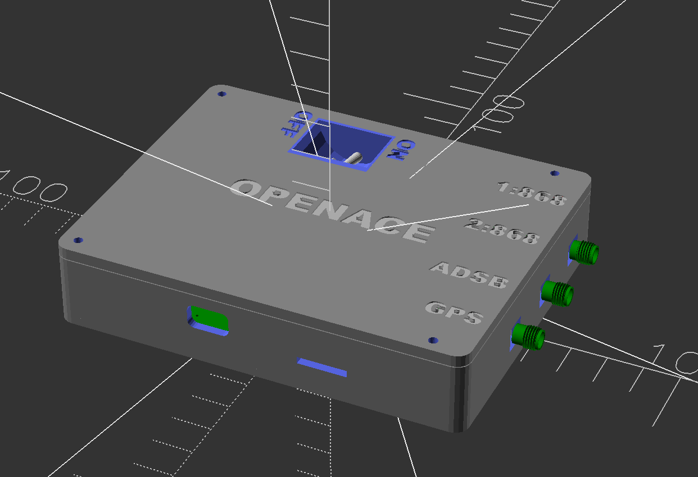
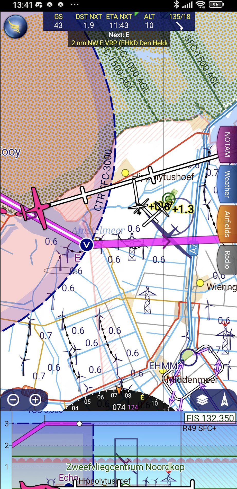
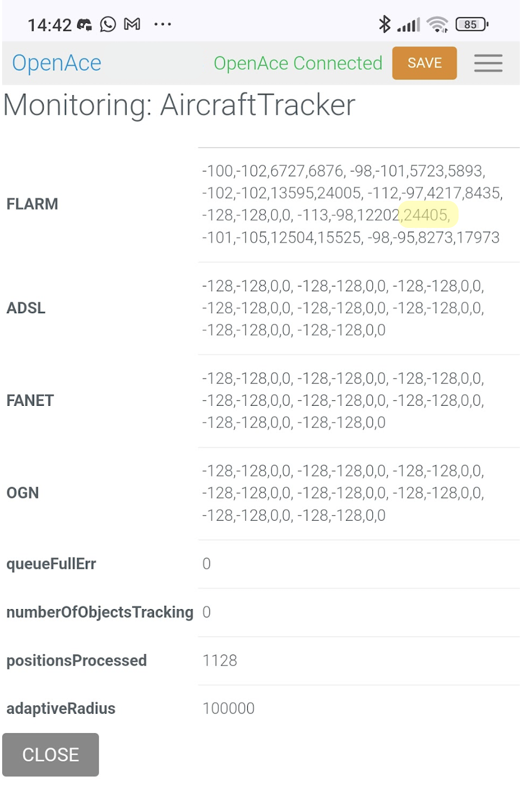
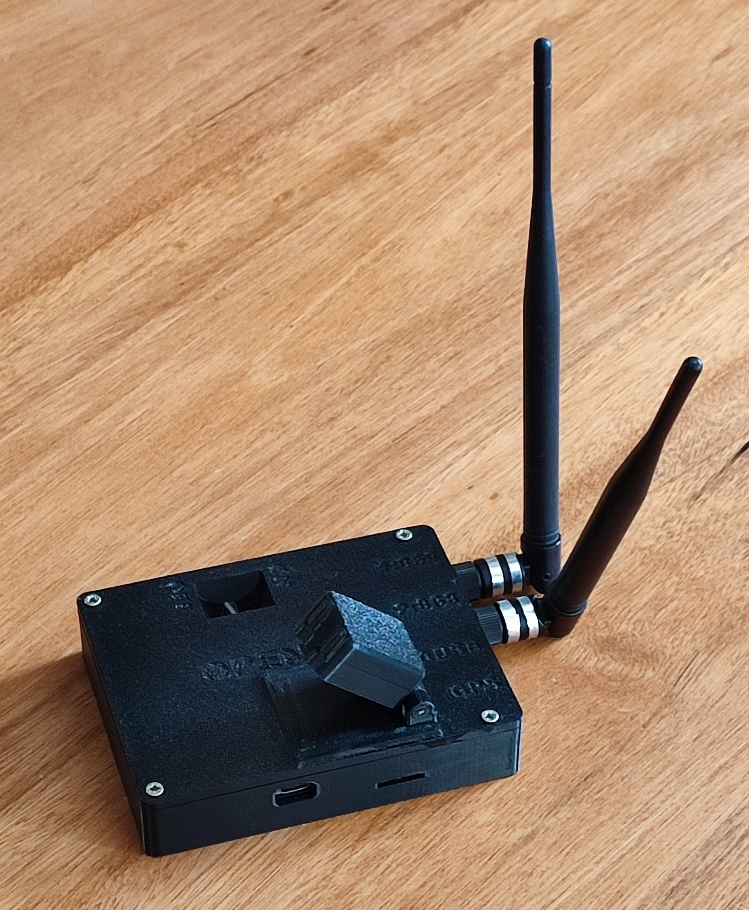

# GA/TAS Conspicuity Device

> [!TIP]
> Please visit the [GA/TAS WIKI](https://github.com/rvt/OpenAce/wiki) for build information.

The GA/TAS Conspicuity device is designed for General Aviation pilots flying in areas where multiple protocols, such as OGN, Flarm, ADS-L and FANET, are used. It can transmit and receive multiple protocols simultaneously (excluding sending ADS-B) using one or more transceiver modules. All received traffic is sent to your Electronic Flight Bag (EFB), such as SkyDemon, via the GLD90 protocol via WIFI or NMEA via bluetooth or WIFI.

The device is built around the Raspberry Pi Pico 2040 and can be configured with a custom PCB that supports either two transceivers or a simpler configuration with one with modules from waveshare which makes it more of a plug-and-play. In both setups, it can send and receive all protocols using time-sharing technology. The device can store configurations for multiple aircraft, which can be selected through an easy-to-use web interface.

Powered by a Li-Ion battery, the device includes a PCB with a USB-C charger. The estimated battery life is between 6 and 10 hours, though this is subject to further testing.

For FLARM it's current range has been tested up to 24Km (see below screenshots) but on average a good 15Km can be expected. THis will give you plenty of time to avoid the traffic. EFB's like SKyDemon can also send out audible traffic warnings.

Note: Although it's primary design is based around GA traffic, there is nothing in the hardware to prevent other use cases like gliders, paragliders and hangliders. The goal of the project is to be seen by transmitting different protocols and beable to see them. 

|        |               |
| ------------------------------------------------- | ----------------------------------------------------- |
|  |  |
|  Showing range of 24Km |  Version I have been flying with |

> [!NOTE]
> The screenshot of SkyDemon was taken from the car while driving for safety reasons. The screenshot of the web interface showing the 24Km was taken while parked and the device placed on top of the car for better air-2-air visibility.

## Radio Protocol Support

Radio Protocol is the method used to communicate with other conspicuity devices

| Radio Protocol | Send               | Receive            | Multi Protocol   |
| -------------- | ------------------ | ------------------ | ------------------ |
| OGN            | :heavy_check_mark: | :heavy_check_mark: | :heavy_check_mark: |
| ADS-L          | :heavy_check_mark: | :heavy_check_mark: | :heavy_check_mark: |
| FLARM (2024)   | :heavy_check_mark: | :heavy_check_mark: | :heavy_check_mark: |
| FANET          | :heavy_check_mark: | :heavy_check_mark: | :heavy_check_mark: |
| ADS-B out      | :no_entry:         | :heavy_check_mark: | :heavy_minus_sign: |
| PAW            | :construction:     | :construction:     | :construction:     |

\* Multi Protocol is a feature of GA/TAS that allows to enable multiple protocols both send and receive on a single transceiver my sharing the air time. The Tranceiver will alternate between the different protocols and prioritice a specific protocol when it receives data for that protocol.

### Communication support

Communication support is what protocols are supported to other devices like electronic flight bags or other equipment.

| Protocol   | Send UDP over WIFI | Receive UDP over WIFI   | Send Bluetooth      | Send TCP over WIFI | Receiver over TCP WIFI |
| ---------- | ------------------ | ----------------------- | ------------------- | ------------------ | ---------------------- |
| GDL90      | :heavy_check_mark: | N/A                     | N/A                 | N/A                | N/A                    |
| AirConnect | N/A                | N/A                     | :heavy_check_mark:  | :heavy_check_mark: | N/A                    |
| Dump1090   | N/A                | N/A                     | N/A                 | N/A                | :heavy_check_mark:     |

\* Sending GDL90 over Bluetooth is not used in the industry so this is currently not setup. If this is really required, then this can be done. Do let me know the use case

### Tested with Electronic Flight Bag

GA/TAS is currently tested with SkyDeamon only,  If you made it work with any other software on Phone or Tabled, do let me know so I can add or help out ot make this work.

| EFB               | GDL90 over WIFI    | Bluetooth             | DataPort (NMEA) WIFI | Note                |
| ---------         | ------------------ |  -------------------- | -------------------- |-------------------- |
| SkyDemon          | :heavy_check_mark: | :heavy_check_mark:    | :heavy_check_mark:   | Tested Frequently during flight   |
| XTrack            |                    | :heavy_check_mark:    |                      | Only tested for connectivity |
| Air navigation    | :heavy_check_mark: |                       |                      | Only tested for connectivity |
| SeeYou Navigator  |                    |  :heavy_check_mark:   |                      | GPS and traffic targets shown     |

## External Libraries and frameworks used

Most libraries are used 'as-is' Some of them have been slightly modified for performance reasons, compatibility or other reasons.

1. Raspberry PI PICO SDK [https://github.com/raspberrypi/pico-sdk](https://github.com/raspberrypi/pico-sdk)
2. FreeRTOS, GA/TAS uses tasks and timers and avoids loops and runs in multi-core SMP mode. [https://www.freertos.org](https://www.freertos.org)
3. LWiP Pretty cool and sometimes confusing TCP/IP protocol suite [https://savannah.nongnu.org/projects/lwip/](https://savannah.nongnu.org/projects/lwip/)
4. ArduinoJSON for loading and storing configuration [https://arduinojson.org](https://arduinojson.org)
5. etlcpp pretty awesome library written by John Wellbelove [https://www.etlcpp.com](https://www.etlcpp.com)
6. libcrc [https://github.com/lammertb/libcrc](https://github.com/lammertb/libcrc)
7. minnmea for parding NMEA sentences [https://github.com/kosma/minmea/](https://github.com/kosma/minmea/)
8. Catch2 for unit testing [https://github.com/catchorg/Catch2](https://github.com/catchorg/Catch2)
8. Easy to use FANET implementation in C++ [https://github.com/rvt/FANET](https://github.com/rvt/FANET)

# GA/TAS Disclaimer

> [!IMPORTANT] > **Important Notice: Use at Your Own Risk**
>
> The GA/TAS Conspicuity Device is provided "as is," without any guarantees or warranties of any kind. By using this device, you acknowledge and agree that:
>
> 1. **No Warranty**: The creators of GA/TAS make no claims or guarantees regarding the accuracy, reliability, or fitness for a specific purpose of the device or its associated software. This includes, but is not limited to, communication with OGN, Flarm, ADS-L, or any other protocols.
> 2. **Assumption of Risk**: You assume full responsibility for any and all risks associated with the use of GA/TAS. This includes, but is not limited to, risks related to hardware malfunctions, software issues, or incorrect transmission/interpretation of data.
> 3. **Limitation of Liability**: Under no circumstances shall the creators, contributors, or affiliates of GA/TAS be held liable for any direct, indirect, incidental, or consequential damages resulting from the use, misuse, or inability to use the device or its software.
> 4. **General Aviation Use**: GA/TAS is intended for use in General Aviation environments where multiple protocols such as OGN, Flarm, and ADS-L are used. It is **not certified** for professional or commercial aviation use and should not be relied upon as the sole source of traffic or navigation information.
> 5. **Compliance**: Users are responsible for ensuring that the use of GA/TAS complies with local aviation regulations and requirements. It is your responsibility to ensure that the device operates within the legal limits and safety standards for your jurisdiction.
>
> By using GA/TAS, you agree to the terms of this disclaimer and acknowledge that you are using the device and its software at your own risk.
