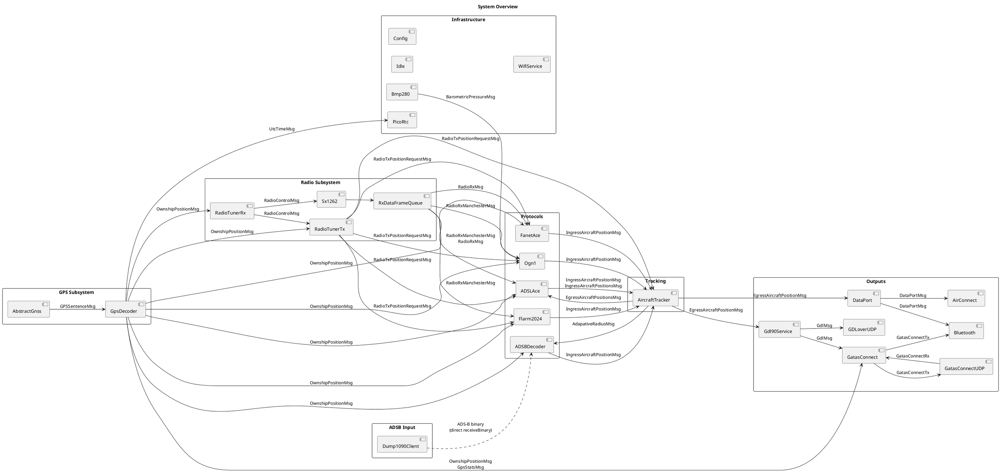
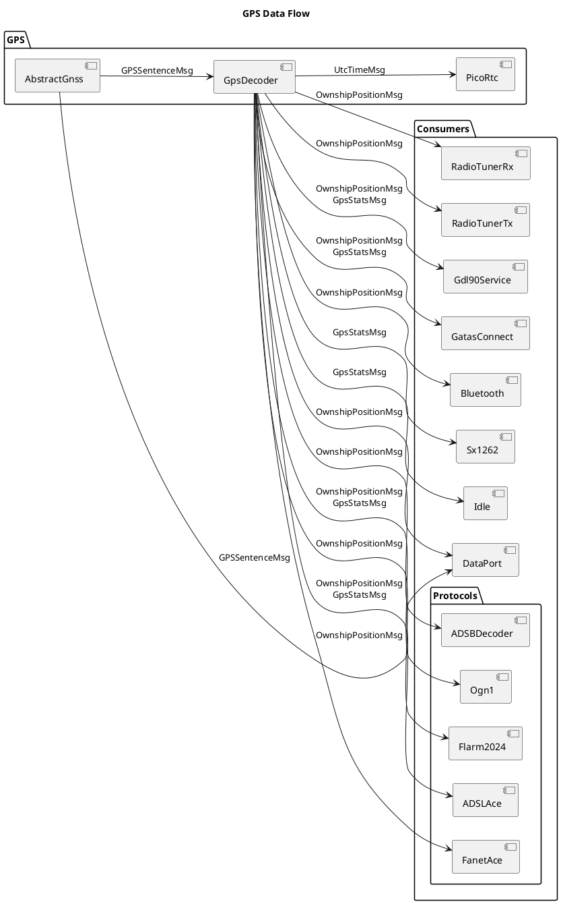
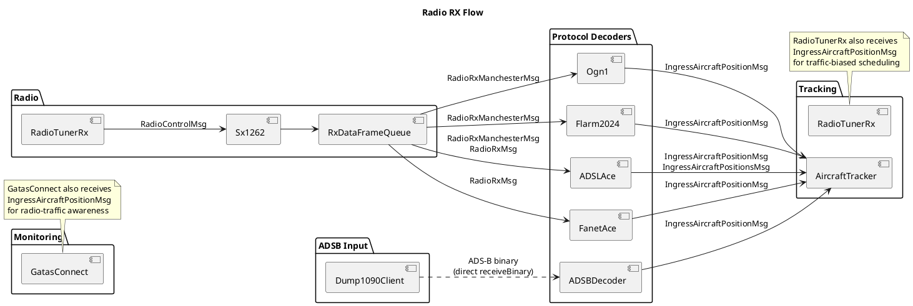
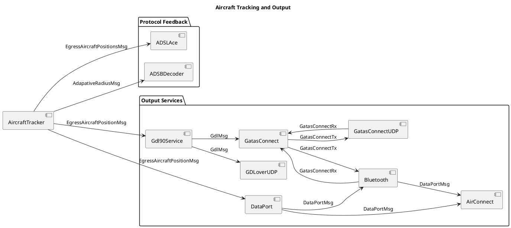
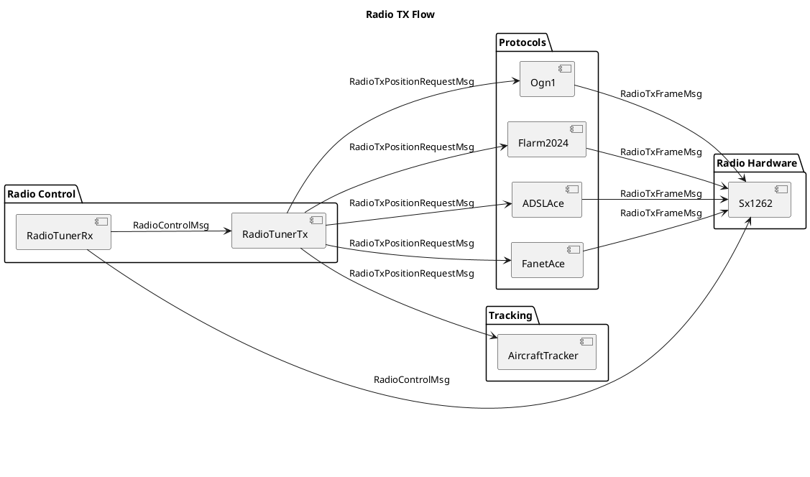
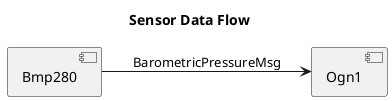

# OpenAce Message Bus

This document maps every message type to its sender(s) and receiver(s).

> **Maintenance note**: Keep this document split into separate flow diagrams. When updating it, change only the affected flow sections and do not collapse everything into one large combined flow unless explicitly asked.

> **How this was generated**: Senders were found by grepping `getBus().receive(` across all `.cpp` files. Receivers were found by grepping `void on_receive(const GATAS::` across all `.hpp` files. The class name was inferred from the enclosing file/class context.

> **Direct handoff note**: Some important current flows are shown even though they are not plain bus publishes, notably `Dump1090Client -> ADSBDecoder` and `Sx1262 -> RxDataFrameQueue`.

## Bus Semantics

- The firmware uses `GATAS::ThreadSafeBus<24>` from `src/lib/core/ace/messagerouter.hpp`.
- Dispatch is synchronous: publishers call `getBus().receive(...)` and the ETL bus delivers directly to subscribers.
- The bus itself does not queue or copy messages.
- `etl::shared_message` is technically supported but explicitly warned against.
- Some important data paths are not bus messages at all; those are called out below.

## Module Topology

```plantuml
' =====================================================================
' TIMER / CONFIG / WIFI
' =====================================================================
@startuml
title Infrastructure Messages

left to right direction

package "Timers" {
    [Idle]
}

package "Configuration" {
    [Config]
}

package "Network" {
    [WifiService]
}

package "Timer Consumers" {
    [ADSBDecoder]
    [WifiService] as WS2
    [AirConnect]
    [AircraftTracker]
    [Bmp280]
    [DataPort]
}

package "Config Consumers" {
    [Sx1262]
    [GDLoverUDP]
    [Ogn1]
    [ADSLAce]
    [FanetAce]
    [ADSBDecoder] as AD2
    [GpsDecoder]
    [GatasConnect] as GC2
    [GatasConnectUDP]
    [RadioTunerRx]
    [RadioTunerTx]
    [AircraftTracker] as AT2
    [Gdl90Service]
    [Bmp280] as BMP2
}

package "Wifi Consumers" {
    [GatasConnect] as GC3
    [GatasConnectUDP] as GU2
    [GDLoverUDP] as GO2
    [DataPort] as DP2
    [Dump1090Client]
    [AirConnect] as AC2
    [Idle] as I2
}

[Idle] --> [ADSBDecoder] : Every5SecMsg
[Idle] --> [WS2] : Every5SecMsg
[Idle] --> [AirConnect] : Every5SecMsg
[Idle] --> [AircraftTracker] : Every5SecMsg
[Idle] --> [Bmp280] : Every30SecMsg
[Idle] --> [DataPort] : Every30SecMsg

[Config] --> [Sx1262] : ConfigUpdatedMsg
[Config] --> [GDLoverUDP] : ConfigUpdatedMsg
[Config] --> [Ogn1] : ConfigUpdatedMsg
[Config] --> [ADSLAce] : ConfigUpdatedMsg
[Config] --> [FanetAce] : ConfigUpdatedMsg
[Config] --> [AD2] : ConfigUpdatedMsg
[Config] --> [GpsDecoder] : ConfigUpdatedMsg
[Config] --> [GC2] : ConfigUpdatedMsg
[Config] --> [GatasConnectUDP] : ConfigUpdatedMsg
[Config] --> [RadioTunerRx] : ConfigUpdatedMsg
[Config] --> [RadioTunerTx] : ConfigUpdatedMsg
[Config] --> [AT2] : ConfigUpdatedMsg
[Config] --> [Gdl90Service] : ConfigUpdatedMsg
[Config] --> [BMP2] : ConfigUpdatedMsg

[WifiService] --> [GC3] : WifiConnectionStateMsg
[WifiService] --> [GU2] : WifiConnectionStateMsg
[WifiService] --> [GO2] : WifiConnectionStateMsg\nAccessPointClientsMsg
[WifiService] --> [DP2] : WifiConnectionStateMsg
[WifiService] --> [Dump1090Client] : WifiConnectionStateMsg
[WifiService] --> [AC2] : WifiConnectionStateMsg
[WifiService] --> [I2] : WifiConnectionStateMsg

@enduml
```

## Active Message Map

| Message | Publisher(s) | Subscriber(s) | Notes |
| --- | --- | --- | --- |
| `GPSSentenceMsg` | `AbstractGnss` | `GpsDecoder`, `DataPort` | Raw NMEA ingress. |
| `OwnshipPositionMsg` | `GpsDecoder` | `Ogn1`, `Flarm2024`, `ADSLAce`, `FanetAce`, `ADSBDecoder`, `RadioTunerRx`, `RadioTunerTx`, `Gdl90Service`, `DataPort`, `Bluetooth`, `GatasConnect` | Main ownship state fan-out. |
| `UtcTimeMsg` | `GpsDecoder` | `PicoRtc` | RTC synchronization. |
| `GpsStatsMsg` | `GpsDecoder` | `Ogn1`, `ADSLAce`, `Sx1262`, `Gdl90Service`, `GatasConnect`, `Idle` | GPS fix and DOP status. |
| `BarometricPressureMsg` | `Bmp280` | `Ogn1` | OGN transmission enhancement. |
| `RadioRxManchesterMsg` | `RxDataFrameQueue` | `Ogn1`, `Flarm2024`, `ADSLAce` | Produced after `Sx1262` receive + Manchester decode. |
| `RadioRxMsg` | `RxDataFrameQueue` | `ADSLAce`, `FanetAce` | Produced after `Sx1262` receive for non-Manchester frames. |
| `IngressAircraftPositionMsg` | `Ogn1`, `Flarm2024`, `ADSLAce`, `FanetAce`, `ADSBDecoder` | `AircraftTracker`, `RadioTunerRx`, `GatasConnect` | Single aircraft decoded from any protocol. |
| `IngressAircraftPositionsMsg` | `ADSLAce` | `AircraftTracker` | Batched ADS-L uplink traffic. |
| `EgressAircraftPositionMsg` | `AircraftTracker` | `Gdl90Service`, `DataPort` | Tracker-selected traffic for outputs. |
| `EgressAircraftPositionsMsg` | `AircraftTracker` | `ADSLAce` | Tracker-selected batch for ADS-L transmit. |
| `AdapativeRadiusMsg` | `AircraftTracker` | `ADSBDecoder` | Decoder radius feedback. |
| `RadioControlMsg` | `RadioTunerRx` | `Sx1262`, `RadioTunerTx` | Current receive slot / radio assignment. |
| `RadioTxPositionRequestMsg` | `RadioTunerTx` | `Ogn1`, `Flarm2024`, `ADSLAce`, `FanetAce`, `AircraftTracker` | Triggers per-protocol transmit preparation. |
| `RadioTxFrameMsg` | `Ogn1`, `Flarm2024`, `ADSLAce`, `FanetAce` | `Sx1262` | Final frame sent to RF hardware. |
| `DataPortMsg` | `DataPort`, `Bluetooth` | `AirConnect`, `Bluetooth` | NMEA-compatible egress and BLE NMEA ingress. |
| `GdlMsg` | `Gdl90Service` | `GDLoverUDP`, `GatasConnect` | Packed GDL90 bytes for network and bridge outputs. |
| `GatasConnectTx` | `GatasConnect` | `GatasConnectUDP`, `Bluetooth` | Framed binary output, transport-agnostic. |
| `GatasConnectRx` | `GatasConnectUDP`, `Bluetooth` | `GatasConnect` | Framed binary input from transports. |
| `WifiConnectionStateMsg` | `WifiService` | `Dump1090Client`, `GDLoverUDP`, `GatasConnect`, `GatasConnectUDP`, `DataPort`, `AirConnect`, `Idle` | Shared network state. |
| `AccessPointClientsMsg` | `WifiService` | `GDLoverUDP` | AP client list for UDP output policy. |
| `ConfigUpdatedMsg` | `Config` | `GpsDecoder`, `Bmp280`, `Sx1262`, `Ogn1`, `ADSLAce`, `FanetAce`, `ADSBDecoder`, `AircraftTracker`, `RadioTunerRx`, `RadioTunerTx`, `Gdl90Service`, `GDLoverUDP`, `GatasConnect`, `GatasConnectUDP` | Runtime config propagation. |
| `Every5SecMsg` | `Idle` | `WifiService`, `AirConnect`, `ADSBDecoder`, `AircraftTracker` | Periodic maintenance. |
| `Every30SecMsg` | `Idle` | `Bmp280`, `DataPort` | Slow periodic maintenance. |

## Messages Currently Defined But Not Active In The Main Flow

| Message | Current status |
| --- | --- |
| `ADSBMessageBinMsg` | Supported by `ADSBDecoder`, but the current `Dump1090Client` path calls `ADSBDecoder::receiveBinary(...)` directly instead of publishing to the bus. |
| `Every1SecMsg` | Emitted by `Idle`, but there are no current subscribers. |
| `Every15SecMsg` | Emitted by `Idle`, but there are no current subscribers. |
| `Every300SecMsg` | Emitted by `Idle`, but there are no current subscribers. |
| `IdleMsg` | Emitted by `Idle`, but there are no current subscribers. |

## Important Non-Bus Paths

- `Dump1090Client -> ADSBDecoder` is a direct call through `BinaryReceiver::receiveBinary(...)`, not a bus message.
- `Sx1262 -> RxDataFrameQueue` uses an internal queue/task handoff before frames become `RadioRxManchesterMsg` or `RadioRxMsg`.
- `Bluetooth` can inject `DataPortMsg` and `GatasConnectRx` into the bus from BLE characteristics.
- `Webserver`, `AceSpi`, and `SerialADSB` are loaded modules, but they are not meaningful bus routers in the current topology.

## Updating This Document

When the topology changes, verify all three of these:

1. Publishers: `rg -n "getBus\\(\\)\\.receive\\(|sendToBus\\(" src/lib src/pico`
2. Subscribers: `rg -n "void on_receive\\(const GATAS::" src/lib`
3. Router declarations: `rg -n "message_router<" src/lib`

Also check for direct module-to-module calls like `receiveBinary(...)`, because those will not appear in a pure bus grep but still affect the effective data flow.
