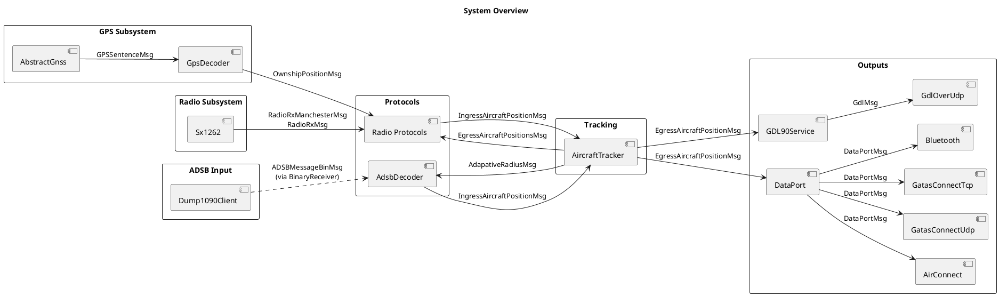
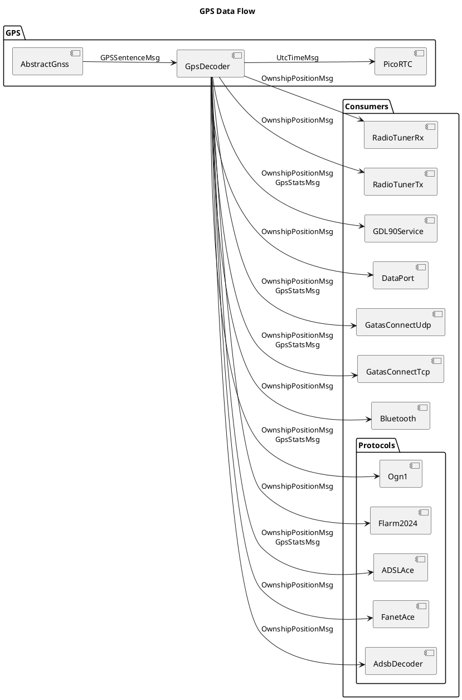
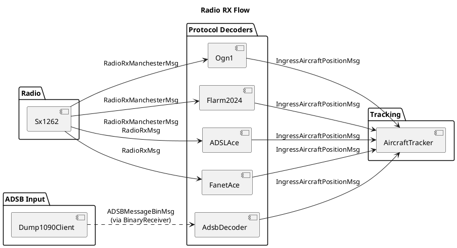
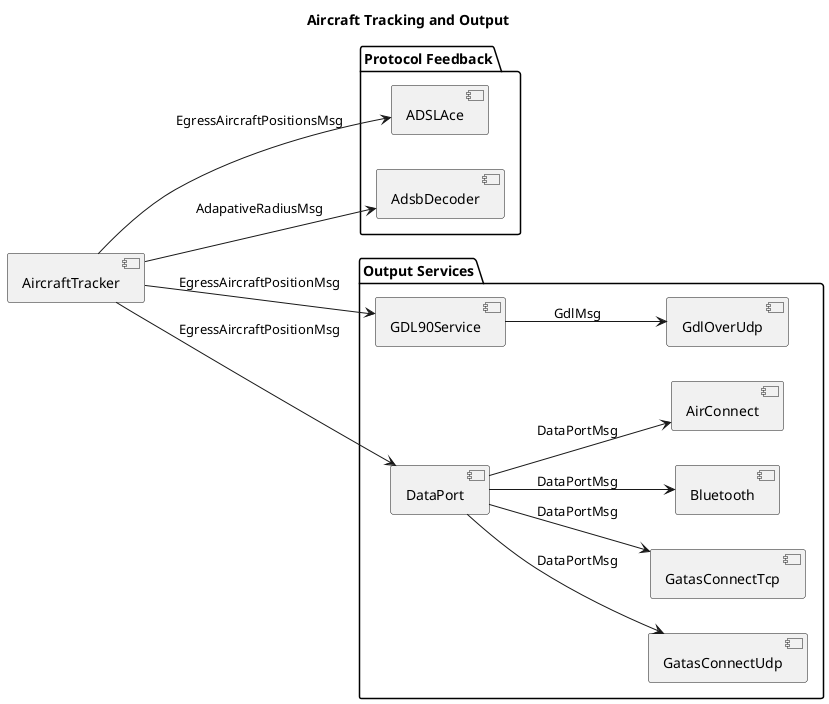
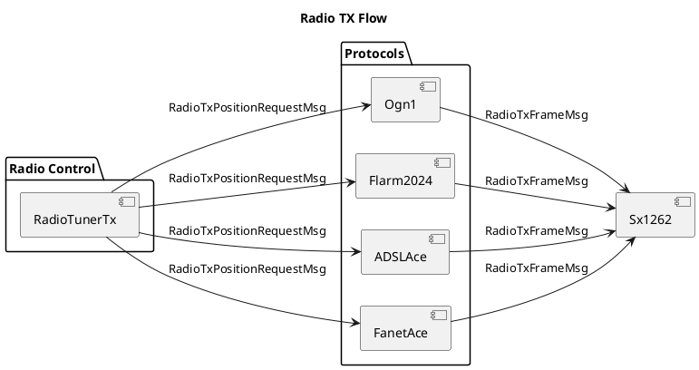
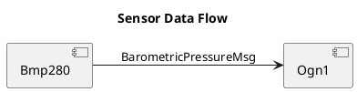

# OpenAce Message Bus

This document maps every message type to its sender(s) and receiver(s).

> **How this was generated**: Senders were found by grepping `getBus().receive(` across all `.cpp` files. Receivers were found by grepping `void on_receive(const GATAS::` across all `.hpp` files. The class name was inferred from the enclosing file/class context.

