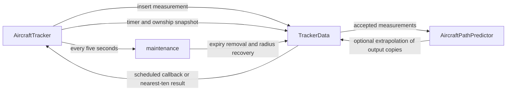

# TrackerData design and refactoring contract

Updated: 2026-09-20.

This document describes the current behavior of
[`TrackerData`](trackerdata.hpp), including the decisions made during its
correctness review. Preserve these contracts when changing its implementation.
Known limitations and possible future changes are identified separately; they
are not requirements to implement as part of a structural refactor.

## 1. Purpose and boundaries

TrackerData is a bounded aircraft-state store with admission policy, output
scheduling, and optional short-term position prediction. It retains the latest
accepted measurement for each aircraft and produces two forms of output:

- Scheduled individual positions for downstream consumers.
- Up to ten nearest eligible positions for ADS-L uplink.

It also enriches callsigns and adjusts its admission radius under storage
pressure. It is not a collision-risk ranking system: selection is by horizontal
distance, without evaluating altitude separation, closing speed, or intent.

[`AircraftTracker`](aircrafttracker.hpp) owns the instance and supplies incoming
measurements, ownship snapshots, timer calls, configuration flags, and external
synchronization. The owner handles queues and message-bus publication;
TrackerData itself does not own a task, timer, or message bus.

The implementation's immediate dependencies are:

| Dependency | Responsibility |
| --- | --- |
| [`AircraftPathPredictor`](aircraftpathpredictor.hpp) | Bounded kinematic history and extrapolation |
| [`CoreUtils`](../../core/ace/coreutils.hpp) | Local time, wrap-safe deadline checks, and relative-distance calculation |
| [`AircraftPositionInfo`](../../core/ace/models.hpp) | Measurement and output representation |
| [`DDB`](../../utils/ace/ddb.hpp) | Optional registration lookup |
| ETL containers and algorithms | Fixed-capacity storage and nearest-ten heap |



## 2. State and configuration

`TrackerData<SIZE, TIMESLICES, MAX_PREDICTED_AIRCRAFT = SIZE>` holds:

| State | Meaning |
| --- | --- |
| `trackedAircraft` | Fixed-capacity map keyed only by `AircraftAddress` |
| `TrackerEntry::position` | Latest accepted measurement, with callsign formatting applied |
| `TrackerEntry::sendTime` | Next deadline for scheduled individual output |
| `pathPredictor` | Optional history/cache for a subset of tracked aircraft |
| `adaptiveRadius` | Admission and accepted-update distance limit in metres |
| Three formatting flags | DDB lookup, source prefix, and squawk display |

Address type and source are metadata, not additional map-key components. There
is one stored measurement per address; this class does not fuse measurements
from competing sources.

Production configuration is 32 track slots and ten timeslices. On RP2040 the
predictor has six slots; other current builds use 32. `MAX_PREDICTED_AIRCRAFT`
must not exceed `SIZE`. Use positive supported container capacities and a
nonzero `TIMESLICES`; do not assume arbitrary template arguments are validated.

| Policy | Current value |
| --- | --- |
| Initial admission radius | 75,000 m |
| Maximum radius during recovery | 100,000 m |
| Recovery increment | 1,000 m per maintenance call |
| Recovery occupancy threshold | Strictly below `floor(SIZE * 75 / 100)` |
| Capacity retention target | `floor(SIZE * 90 / 100)` existing tracks |
| Scheduled heartbeat | 1,000,000 microseconds |
| Measurement expiry | Age greater than or equal to 10,000,000 microseconds |
| Radio-source preference | Measurement age strictly below 4,000,000 microseconds |
| ADS-L result capacity | Ten aircraft |

DDB lookup, source prefix, squawk display, and prediction output start disabled.
`AircraftTracker` supplies their configured values. Prediction history is still
updated when prediction output is disabled. Enabling prediction can therefore
use already collected history.

## 3. Time and input contracts

Three different times must remain distinct:

1. **Measurement time:** the timestamp of the accepted aircraft sample.
2. **Send deadline:** local scheduling state, independent of new observations.
3. **Predicted output time:** the time to which a copy was extrapolated.

Measurement timestamps must already be expressed in the local
`CoreUtils::timeUs32()` frame. Conversion from remote packet time belongs
upstream. A valid restored measurement is now-or-past, not future-dated.

All three values use wrapping 32-bit microseconds. Compare deadlines with
`CoreUtils::isUsReached()` and sample order through the signed timestamp
difference. These comparisons assume relevant time separations below half the
32-bit range, approximately 35.8 minutes. Do not replace them with ordinary
unsigned `<` comparisons or with epoch timestamps.

Input coordinates, kinematics, source, and `distanceFromOwn` are supplied by
the caller. This class does not comprehensively validate their physical
plausibility or recompute admission distance. Speeds are metres/second, track
is degrees clockwise from north, and horizontal turn rate is degrees/second.
An unavailable turn rate must be non-finite; zero explicitly means straight
flight to the predictor.

`insert()` does not reject an otherwise acceptable sample solely for already
being ten seconds old. Such a stored sample is ineligible for output and is
later reclaimed. Tightening input-age validation would be a separate behavior
change.

## 4. Insertion and source selection

### Existing address: preserve this decision order

1. Reject a timestamp older than the stored measurement. Equal timestamps may
   replace a sample, subject to the following checks.
2. Reject ADS-B or MLAT while the stored source is direct radio
   (`dataSource < DataSource::_RADIO`) and the stored measurement is younger
   than four seconds. At exactly four seconds, this preference has expired.
3. If the accepted incoming report is outside the radius, remove the stored
   track and its predictor state, then return `false`.
4. Apply callsign enrichment, replace the measurement, and update the predictor.
5. Preserve the existing `sendTime`; return `true`.

Source preference must precede destructive radius handling. Otherwise an
out-of-range ADS-B/MLAT report can delete a fresh radio track even though that
report would be rejected for an in-range position. This preference is a policy,
not a claim that every direct-radio observation is more accurate.

### New address

1. Reject a candidate outside the current radius.
2. If storage is full, remove expired entries first.
3. If no expired entry was removed, perform bounded farthest-track cleanup.
4. Check that storage has room and recheck the candidate against the radius
   calculated by cleanup.
5. Enrich the callsign, store the measurement with `sendTime = now`, and offer
   the sample to the predictor.

A candidate exactly on the radius is accepted. Predictor admission can fail
because its smaller capacity favors nearer aircraft; successful tracker
insertion does not require a predictor slot.

### Return value and side effects

`true` means the incoming sample was stored. **`false` does not mean no state
changed:** an accepted out-of-range update can remove an existing track, and a
rejected newcomer can have triggered capacity cleanup and radius reduction.

The input parameter is mutable. Successful enrichment can change its callsign.
Refactors should preserve these semantics or deliberately replace the boolean
with a clearly documented result type and update all callers.

## 5. Capacity management and radius

When full and unable to reclaim expired tracks, repeatedly scan for the farthest
track and remove it until only `floor(SIZE * 90 / 100)` remain. The existing
`ByDistance` comparator orders by distance first, then address; equal-distance
cleanup therefore removes the highest address first.

Each removal also removes the matching predictor state and sets the radius to
that aircraft's stored distance. The final removal leaves the final radius at
or beyond every retained track's stored distance. **Do not round this radius
down or use it to remove all tracks at the boundary.** Either change can destroy
an entire group of aircraft at similar distances.

For 32 slots, cleanup removes four existing aircraft. A subsequently accepted
newcomer leaves 29 tracks and three free slots. If the newcomer is rejected by
the reduced radius, the four freed slots remain available. This is intentional:
the agreed simple policy does not roll back cleanup or rank the candidate before
eviction.

Example: existing distances are 1–32 km. Removal visits the tracks at 32, 31,
30, and 29 km, leaving a 29 km radius. A newcomer at 29 km is accepted; a newcomer
at 70 km is rejected, although it passed the original 75 km radius check.

Cleanup uses stored measurement distances, not freshly predicted distances.
Radius recovery occurs only through `maintenance()`: after expiry removal, if
occupancy is strictly below the 75% threshold, increase the radius by 1 km,
capped at 100 km. At the owner's normal five-second cadence this is 1 km per
five seconds while occupancy remains low; calling maintenance more often changes
that recovery rate.

## 6. Scheduled individual output

The owner normally calls `sendScheduled()` every `1000 / TIMESLICES` milliseconds
(100 ms for ten timeslices). Each call snapshots local time and calculates:

```text
maxPerRound = ceil(stored track count / TIMESLICES)
```

It scans map order, skipping expired measurements and deadlines not yet due.
For each eligible entry it predicts a copy, invokes the callback, and sets the
next deadline to `currentTime + 1 second`. It stops when the quota is reached.

The quota is based on stored count, including entries awaiting expiry cleanup.
Skipped expired entries do not consume quota. ADS-L requests do not consume this
quota or change individual deadlines.

An existing aircraft's new observation must **not reset its deadline**. New
measurements replace the data to be sent, while the heartbeat controls when it
is emitted. This prevents sustained high-rate observations from repeatedly
making the first map entry eligible ahead of other tracks. A measurement arriving
just after output may wait almost one second for the next scheduled emission.

Normal input is approximately 1 Hz. Regression coverage also exercises 10 Hz
updates to one or all aircraft. With ten aircraft and regular 100 ms calls,
every aircraft is emitted once per second using its latest accepted sample.
This is not a hard real-time fairness guarantee for arbitrary stalls or changing
membership. The implementation has no rotating cursor or oldest-due scheduler.
Missed intervals do not generate catch-up bursts.

## 7. Expiry, prediction, and stored measurements

Both output paths check **stored measurement age before prediction**. At exactly
ten seconds, the track becomes ineligible even if maintenance has not run. This
prevents the predictor's expired-sample fallback from moving output backward to
the original measured position.

Filtering does not erase entries. Physical removal occurs in five-second
maintenance or cleanup on insertion into full storage. Consequently `size()`,
`full()`, `forEachPosition()`, and diagnostic output can include expired entries
waiting for cleanup. A later accepted fresh observation can revive an entry
before cleanup.

Output always starts as a copy of the stored measurement. Prediction must not
overwrite stored coordinates, distance, or timestamp. Otherwise successive
outputs could extrapolate previously predicted data and hide the real sample age.

The predictor is a separate bounded cache, not a second authoritative position
store. Its current integration contract is:

- Keep up to three kinematic samples per admitted address; updates invalidate
  cached predictions. Equal timestamps replace the latest sample.
- History is keyed by address; changing the accepted data source does not by
  itself clear the history or perform source-specific uncertainty handling.
- Prefer closer candidates when a new predictor slot is needed. Ranking uses
  last supplied distances; there is no continuous global reranking against
  moving ownship. Losing a predictor slot does not delete the tracker entry.
- For ages below 500 ms, disabled prediction, or missing predictor history,
  return the measurement unchanged. Extrapolate from 500 ms up to, but excluding,
  ten seconds when usable state exists.
- Use constant ground speed and constant vertical speed. Horizontal motion is
  straight or a constant-turn arc. A finite protocol turn rate takes priority;
  otherwise recent heading segments estimate it with weights 2:1. Turn rate is
  limited to plus/minus 15 degrees/second. Derived segments require intervals
  of 0.2–5 seconds and endpoint ground speeds of at least 3 m/s.
- Set a predicted copy's timestamp to prediction time and invalidate its distance
  with `static_cast<uint32_t>(INT32_MIN)`. TrackerData refreshes that distance
  against the supplied ownship snapshot.
- Removing a tracker entry must remove its predictor state too. Predictor
  maintenance can independently reclaim expired history.

### Deferred distance refresh behavior

When prediction returns the measurement unchanged, the original distance is
normally retained even if ownship has moved. Nearest-ten selection can therefore
mix refreshed and older distances. This was deliberately deferred: affected
tracks without predictor slots are usually farther away, and meaningful impact
on realistic traffic has not been established. Disabled prediction can also
affect nearby tracks. A refactor must not silently add unconditional distance
recalculation; reassess its value and cost as a separate change.

### Limits of the motion model

The model bridges short reception gaps; it does not infer future pilot intent,
turn rollout, acceleration, or level-off. Recent turn history can continue to
influence prediction after a maneuver changes. Predicted output also has no
separate measurement-age or confidence field. Existing ideal-motion tests do
not establish accuracy across all real flight maneuvers.

## 8. ADS-L nearest-ten output

`adslUplinkTrigger(ownship)` returns a fixed-capacity list of up to ten unexpired
output copies. For at most ten stored entries, filter and append directly. For
larger stored sets, collect up to ten live candidates, build a max-heap with the
farthest at its root, and replace that root whenever a closer candidate appears.

Filter before prediction and before occupying a heap slot. Fewer than ten live
tracks must produce a correspondingly smaller result, including an empty result
when all stored tracks have expired. Use distance, then address, for selection;
lower addresses win equal-distance cutoff ties. Result order is unspecified.

The result contains measured or predicted positions according to each track's
predictor availability. This path does not advance `sendTime`, reclaim tracker
entries, or change the adaptive radius. Its `const` signature does not imply
thread safety: prediction can update a mutable internal cache.

## 9. Callsign formatting

Accepted inserts and replacements apply formatting in this order:

1. If DDB lookup is enabled and the callsign is empty, use a registration match.
2. If squawk display is enabled and squawk is known (`!= -1`), replace the callsign
   with its zero-padded four-digit decimal representation.
3. If source prefix is enabled, prepend the short source code.

ETL's fixed callsign capacity governs truncation. A source prefix can also create
a callsign when the input is empty. Changing formatting flags does not rewrite
existing stored callsigns; new accepted measurements receive the new formatting.
Repeatedly passing an already prefixed mutable input is not guaranteed to be
idempotent. The public formatting helpers are also directly callable, but normal
insertion uses the sequence above.

## 10. Ownership, callbacks, and memory

TrackerData has no internal mutex. The owner protects its task operations and
inspection with a `SemaphoreGuard`; a refactor must preserve serialized access
to the instance, including predictor caches. Configuration setters are currently
invoked directly from the owner's configuration handler: verify that lifecycle
and synchronization separately if moving configuration work across tasks.

When notifications coincide, the owner processes maintenance, incoming samples,
scheduled output, then ADS-L output. Applying samples before output avoids using
old measurements on that tick. The owner also requires valid ownship before
calling either output path; TrackerData does not independently validate ownship.

Callbacks are synchronous. Scheduled output passes a reference to a temporary
copy; inspection passes references to stored entries. Consumers must copy data
they retain. Do not mutate the tracker reentrantly from either callback while
its map is being traversed. Keep callbacks bounded because the owner's lock is
held through normal task-driven output.

The design uses fixed-capacity storage and bounded loops:

| Operation | Cost excluding callback and predictor internals |
| --- | --- |
| Existing-address lookup/update | Hash lookup and constant policy checks |
| Scheduled round | Up to `SIZE` entries scanned; predictions bounded by quota |
| Expiry cleanup | One scan of stored entries |
| Full-store trimming | `k` scans, where `k = SIZE - floor(SIZE * 90 / 100)` |
| Nearest-ten selection | One scan plus heap operations on at most ten elements |

At 32 slots, trimming examines 32 + 31 + 30 + 29 = 122 entries. It uses no sorting
buffer or new allocation. Predictor operations have their own bounded scans;
these counts are not measured execution-time guarantees. Hash lookup also should
not be described as a worst-case constant-time guarantee.

Nearest-ten output uses both a ten-element temporary array and the returned
fixed-capacity list. Preserve stack and object-size budgets on embedded targets.
Retain float-based prediction arithmetic unless a separate precision change is
justified and measured. `SLICE_SIZE_MS` and `TIME_SEND_HYSTERESIS` currently do
not drive class behavior; the owner drives the timer cadence.

## 11. Refactoring checklist and regression evidence

Preserve these observable properties before changing containers or splitting
responsibilities:

- Timestamp rejection precedes source preference; source preference precedes
  destructive radius handling.
- Measurement replacement preserves the existing output deadline.
- Both output paths stop emitting at the exact expiry boundary, independently
  of cleanup cadence and prediction availability.
- Predictions modify output copies, not the stored measurement timeline.
- Capacity eviction is bounded by count, with deterministic distance ties.
- Retained tracks remain at or inside the radius; candidate admission rechecks
  that radius after cleanup and permits equality.
- Cleanup may have side effects even when insertion returns `false`.
- Tracker removal removes matching prediction history; missing prediction
  history does not make a live measurement ineligible for output.
- Inspection is an unfiltered view of storage, distinct from flight-data output.
- Formatting order, callback lifetimes, and the deferred distance policy remain
  explicit contracts.

Keep the policy decisions above separate from structural changes. Possible
internal seams are admission/eviction, emission scheduling, output-copy creation,
and metadata enrichment; extracting them is optional. Prefer small helpers over
new allocation, virtual interfaces, or a generalized scheduler without a clear
need. If introducing a test clock or shared lifetime constants, preserve wrap
semantics and keep the tracker and predictor expiry horizons aligned.

The regression suite is in
[`trackerdata_test.cpp`](../aircrafttracker_tests/trackerdata_test.cpp), with
prediction math tests in
[`aircraftpathpredictor_test.cpp`](../aircrafttracker_tests/aircraftpathpredictor_test.cpp).

| Contract | Current regression coverage |
| --- | --- |
| Deadline preservation | 1 Hz/10 Hz input, one/all aircraft updated, per-address output, latest sample, clock wrap |
| Expiry | Before/at/after ten seconds, both outputs, prediction on/off, missing history, fresh-update recovery |
| Capacity | Clustered/equal/sub-500 m distances, insertion order, retained predictor entries, repeated pressure, small capacity |
| Source preference | ADS-B/MLAT versus radio, four-second boundary, older/equal/newer timestamps, clock wrap, preserved state |
| Admission radius | Inside/on/outside the reduced radius; expired full storage; a nearer follow-up after rejection |
| Nearest-ten filtering | Mixed expired/live sets, including zero, fewer than ten, and more than ten live tracks |

The latest completed validation before this document was written passed 30
tracker cases with 5,289 assertions and 20 predictor cases with 115 assertions.
A randomized tracker run also passed. The scheduling regression was separately
verified to fail when the old deadline reset was restored in a temporary copy.
These results are a dated baseline, not a substitute for rerunning tests.

From the repository root, using an existing configured desktop build:

```sh
rtk proxy cmake --build src/build_test --target trackerdata_test aircraftpathpredictor_test -j 4
rtk proxy src/build_test/lib/aircrafttracker/aircrafttracker_tests/trackerdata_test
rtk proxy src/build_test/lib/aircrafttracker/aircrafttracker_tests/aircraftpathpredictor_test
rtk proxy src/build_test/lib/aircrafttracker/aircrafttracker_tests/trackerdata_test --order rand --rng-seed 17
```

The build runs tests after linking; explicit executable runs also cover a
no-work build. For resource or platform-sensitive refactors, check embedded
compilation and stack/object sizes as well.

Remaining validation work includes scheduler jitter/stalls and changing
membership, maneuver transitions, irregular reception, source switching,
predictor-slot changes, and broader formatting/invalid-input coverage. Some
older tests inspect private state or have unrealistic time fixtures; prefer
public output assertions and consistent mock clocks in new tests.

The local review workfile `trackerdata-plan.md` records implementation history
and deferred work, but is currently Git-ignored. This design document is intended
to remain with the source and does not require that local workfile to be present.
