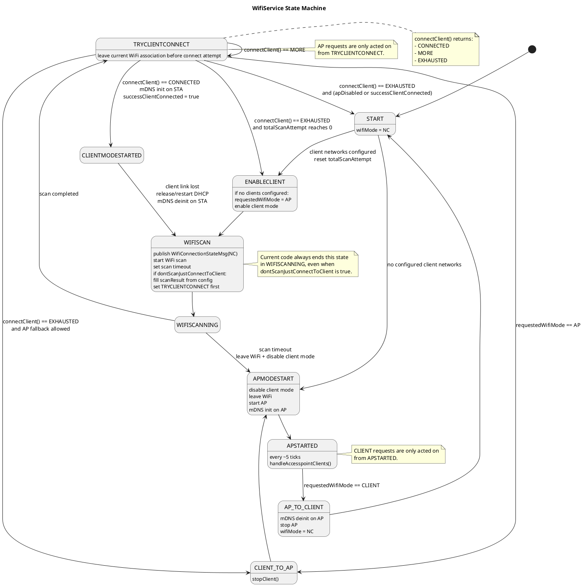

# WifiService State Machine

This document describes the current `WifiService::wifiTask()` state machine in
`src/lib/wifiservice/ace/src/wifiservice.cpp`.

## Notes

- `requestedWifiMode` is updated externally through `WifiModeRequestMsg` or
  `setData(..., "startAp")`.
- The task wakes roughly once per second and advances the state machine.
- The diagram below reflects the current implementation, including the current
  transition targets in code.

## PlantUML

## Decision Summary

- If no client networks are configured, startup goes directly to AP mode.
- If client networks are configured, startup first tries STA/client mode.
- `ENABLECLIENT` also collapses `requestedWifiMode` back to `AP` when the client
  list is empty.
- `ENABLECLIENT` currently always transitions into `WIFISCAN`.
- `WIFISCAN` currently always ends in `WIFISCANNING`; when
  `dontScanJustConnectToClient` is true it also pre-fills `scanResult` first.
- A request for AP mode is currently handled in `TRYCLIENTCONNECT`.
- A request for client mode is currently handled in `APSTARTED`.
- Loss of an active client connection currently goes directly back into
  `WIFISCAN`.
