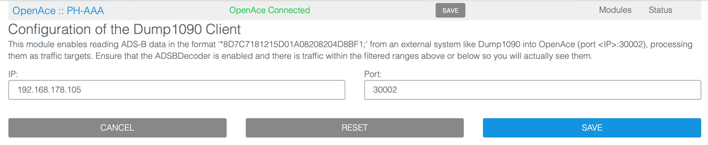
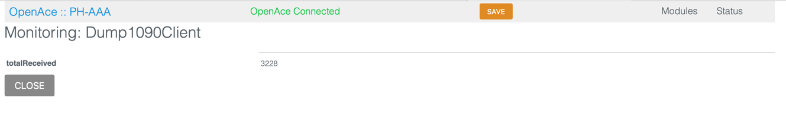

## ADSB Test Server

This small utility reads back an adsb.txt file and tries tp spit it out at the same speed it received the data on.

How to run:

```bash
rvt@xxxxx adsb % npm install

added 2 packages, and audited 3 packages in 923ms

found 0 vulnerabilities
```

Then run:

```bash
rvt@xxxxx adsb % node server.js ../adsb.txt 30002
Server listening on port 30002
```

It will now read the text file `adsb.txt` in the above directory and open port 30002.
Then simply tell OpenACE to connect to this computer andport from the Dump1090Client module.

The Dump1090 Client module will use the configuration without rebooting after changing.



When everything works and the connection is made, the received counter should steadly increase:

Note: If you have dump1090 running you could also connect to this. The data is exactly the same.



